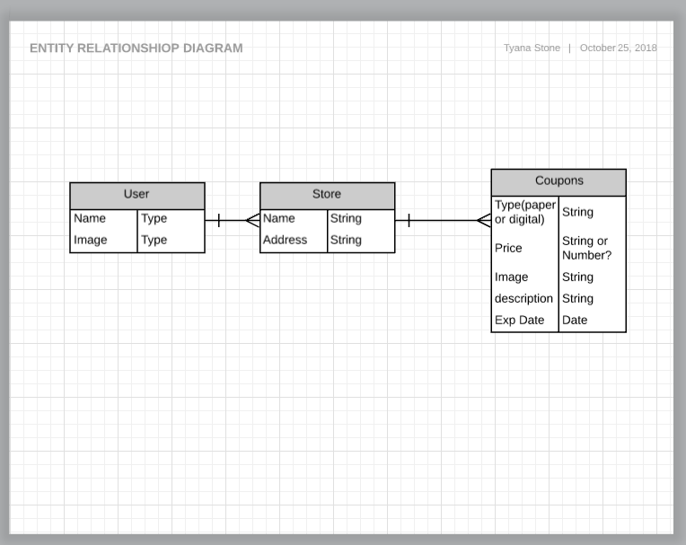
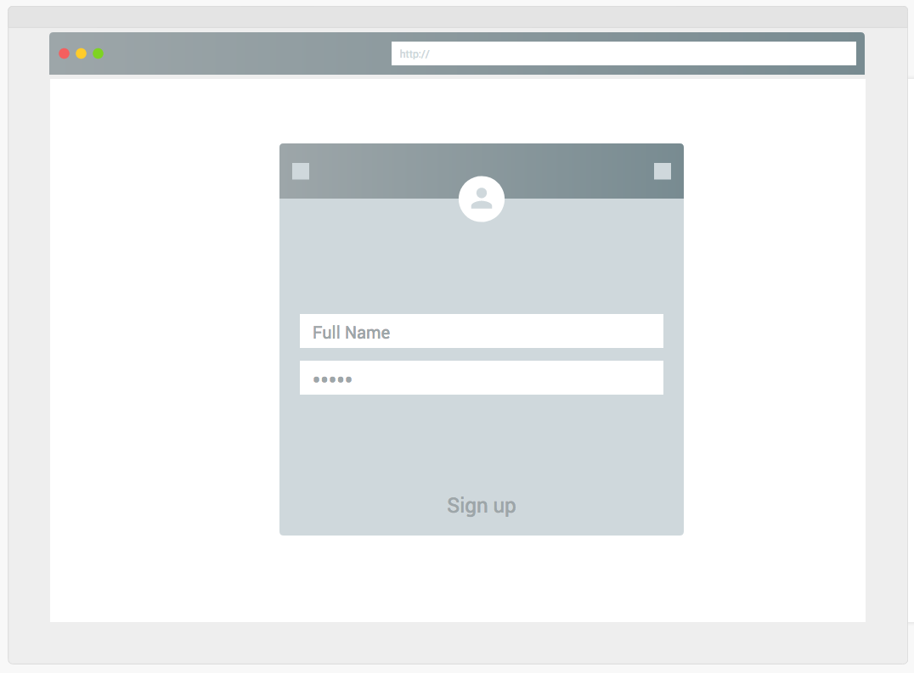
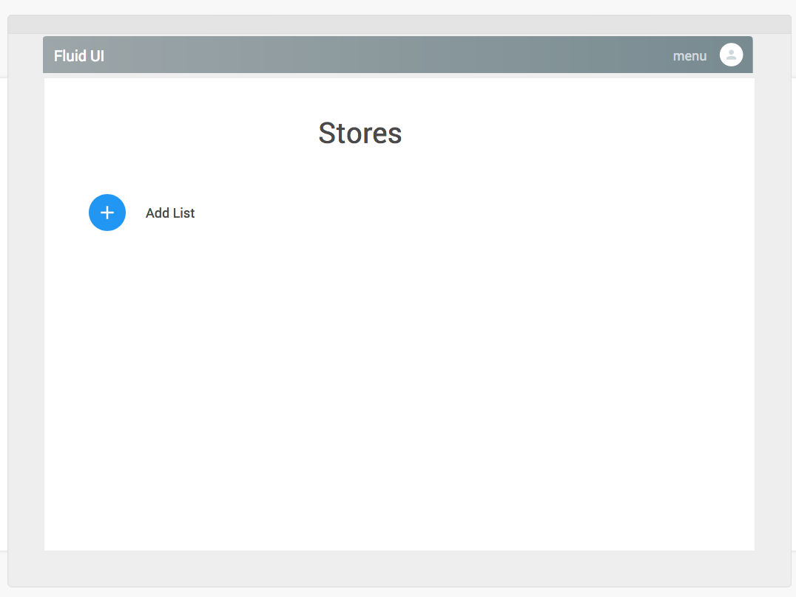
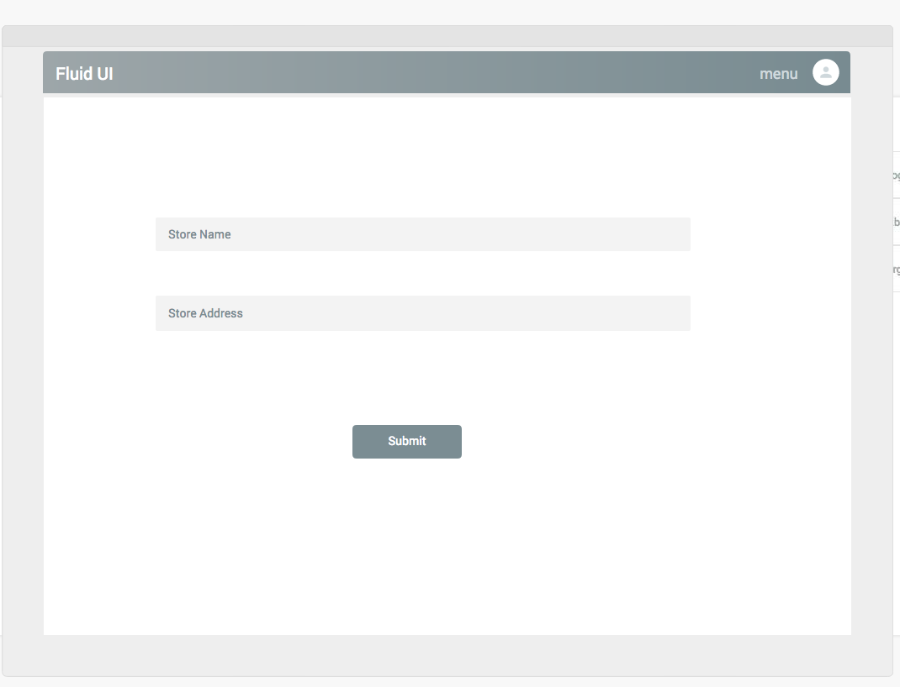
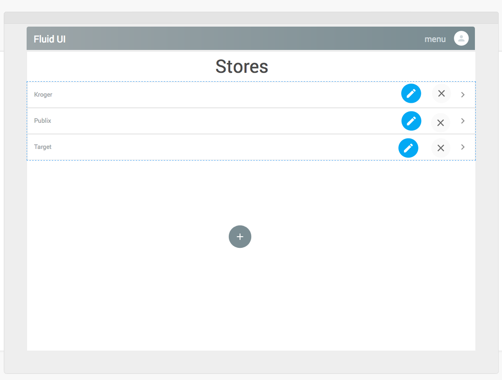
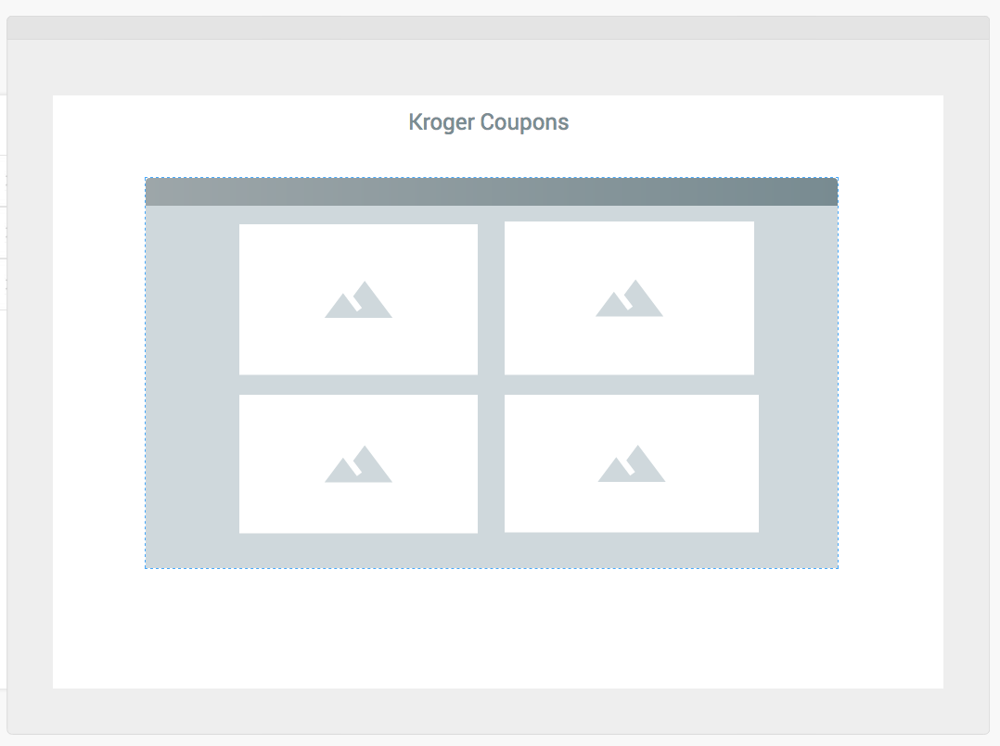

# Krazy-Koupon-Queen-List

#### Project Description

[Click Here for Assignment Page](https://git.generalassemb.ly/atl-wdi/wdi-curriculum/tree/master/projects/unit_02)

 #### Entity Relationship Diagram

#### Wireframe

#### Trello
 [Click Here For Trello](https://trello.com/b/J2Frfqyc/project-2)

#### Libraries Used
 | Library | Link |
| --- | --- |
| Animations | [Animista](http://animista.net/) |
| Handlebars | [Hbs](https://handlebarsjs.com/) |
| jQuery | [jQuery](https://jquery.com/) |
| Bootsrap | [Bootstrap](https://getbootstrap.com/docs/4.0/components/card/) |
| Animations |[Animate.css](https://daneden.github.io/animate.css) |

 #### Commit Count: 50

#### Wishes & Dreams

- I wish that I was able to add a timer to all questions with music.
- I wish that I was able to add more styling to my game. Most of my time went to html and javascript instead of styling. 

#### Web Application
[Click Here For Site](https://silly-kepler-3145a0.netlify.com/)